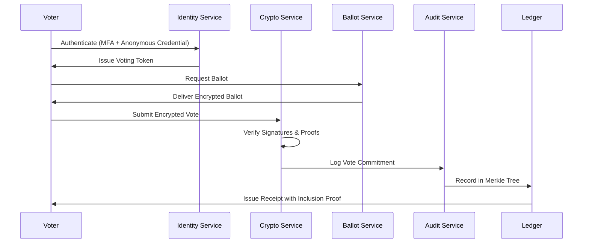
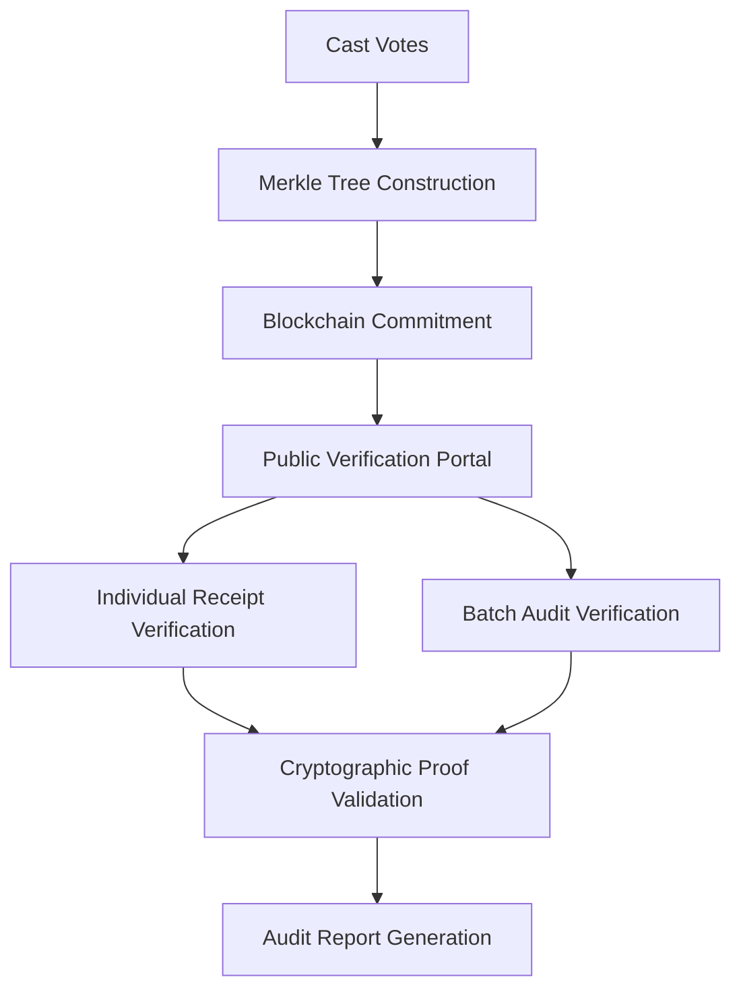

# Vote-Secured.net State Implementation Guide
## Comprehensive Deployment Documentation for Election Boards

---

## Table of Contents

1. [Executive Summary](#executive-summary)
2. [Pre-Implementation Requirements](#pre-implementation-requirements)
3. [Technical Architecture Overview](#technical-architecture-overview)
4. [Phase-by-Phase Implementation Plan](#phase-by-phase-implementation-plan)
5. [Security Framework Implementation](#security-framework-implementation)
6. [Compliance and Certification](#compliance-and-certification)
7. [Training and Change Management](#training-and-change-management)
8. [Operations and Maintenance](#operations-and-maintenance)
9. [Disaster Recovery and Business Continuity](#disaster-recovery-and-business-continuity)
10. [Appendices](#appendices)

---

# Executive Summary

This comprehensive implementation guide provides state election boards with detailed procedures, technical specifications, and best practices for deploying the Vote-Secured.net electronic voting system. The guide covers all aspects of implementation from initial planning through full operational deployment.

## Key Implementation Outcomes

- **Enhanced Security**: Implementation of NIST 800-53 (High) controls and advanced cryptographic protections
- **Improved Accessibility**: Universal design principles ensuring equal voting access for all citizens
- **Transparent Auditing**: Comprehensive audit trail with cryptographic verification capabilities
- **Regulatory Compliance**: Full adherence to EAC VVSG 2.0, IEEE 1622, and Common Criteria EAL4+ standards
- **Operational Efficiency**: Streamlined election management with real-time monitoring and automated processes

---

# Pre-Implementation Requirements

## Legal and Regulatory Prerequisites

### State Legislative Requirements
- [ ] **Election Code Amendments**: Review and update state election codes to authorize electronic voting systems
- [ ] **Certification Authority**: Establish state certification authority for voting system approval
- [ ] **Audit Requirements**: Define mandatory post-election audit procedures and statistical methods
- [ ] **Public Records Laws**: Update public records statutes to address electronic voting data

### Federal Compliance Requirements
- [ ] **EAC VVSG 2.0 Certification**: Obtain federal voting system certification
- [ ] **NIST 800-53 Compliance**: Implement all High baseline security controls
- [ ] **Section 508 Compliance**: Ensure accessibility compliance for all interfaces
- [ ] **CISA Coordination**: Establish reporting relationship with Cybersecurity and Infrastructure Security Agency

## Organizational Readiness Assessment

### Leadership and Governance
- [ ] **Executive Sponsorship**: Secure commitment from Secretary of State and Governor's office
- [ ] **Stakeholder Buy-in**: Obtain support from county election officials, legislators, and advocacy groups
- [ ] **Governance Structure**: Establish voting system oversight committee with technical expertise
- [ ] **Change Management Leadership**: Designate change management champions at state and county levels

### Technical Infrastructure Assessment
- [ ] **Network Infrastructure**: Evaluate existing network capacity and security architecture
- [ ] **Data Center Capabilities**: Assess hosting requirements for high-availability deployment
- [ ] **Personnel Readiness**: Evaluate current IT staff capabilities and training needs
- [ ] **Budget Planning**: Develop comprehensive budget including all implementation phases

## Budget and Resource Planning

### Implementation Cost Estimates

| Phase | Duration | Cost Range | Key Activities |
|-------|----------|------------|----------------|
| **Phase 1: Planning & Design** | 3-4 months | $500K - $750K | Requirements gathering, architectural design, procurement |
| **Phase 2: Core Development** | 8-12 months | $2.5M - $4M | System development, security implementation, testing |
| **Phase 3: Pilot Deployment** | 4-6 months | $750K - $1.2M | Pilot rollout, user training, system optimization |
| **Phase 4: Statewide Rollout** | 6-9 months | $1.5M - $2.5M | Full deployment, training, change management |
| **Phase 5: Operations (Annual)** | Ongoing | $400K - $600K | Operations, maintenance, support, compliance |

### Resource Requirements

#### Technical Personnel
- **Project Manager**: PMP certified with election technology experience
- **Security Architect**: CISSP certified with cryptographic expertise
- **Systems Engineers** (3-4): Experience with high-availability systems
- **Database Administrators** (2): Expertise in secure database management
- **Network Engineers** (2): Experience with secure network design
- **Quality Assurance** (2-3): Testing and validation expertise
- **Training Specialists** (2): Adult learning and technology training

#### External Resources
- **Security Auditors**: Independent third-party security assessment
- **Legal Counsel**: Election law and technology contracting expertise
- **Change Management Consultants**: Organizational change management
- **Accessibility Consultants**: Section 508 and WCAG compliance
- **Public Relations**: Stakeholder communication and public engagement

---

# Technical Architecture Overview

## System Architecture Components

### Core Voting Platform
```
┌─────────────────────────────────────────────────────────────┐
│                    Vote-Secured.net Platform               │
├─────────────────────────────────────────────────────────────┤
│  Voter Interface Layer                                     │
│  ├── Web Portal (HTML5/JavaScript)                        │
│  ├── Mobile Applications (React Native)                   │
│  ├── Kiosk Interface (Electron)                          │
│  └── Accessibility Support (WCAG 2.1 AA)                 │
├─────────────────────────────────────────────────────────────┤
│  Authentication & Authorization                            │
│  ├── Anonymous Credential System (zkSNARKs)               │
│  ├── Multi-Factor Authentication                          │
│  ├── Identity Verification Service                        │
│  └── Access Control Engine (ABAC)                         │
├─────────────────────────────────────────────────────────────┤
│  Cryptographic Services                                    │
│  ├── End-to-End Encryption (AES-256-GCM)                 │
│  ├── Digital Signatures (ECDSA P-384)                     │
│  ├── Homomorphic Encryption (Paillier)                    │
│  └── Zero-Knowledge Proofs (Bulletproofs)                 │
├─────────────────────────────────────────────────────────────┤
│  Ballot Management                                         │
│  ├── Ballot Definition Service                            │
│  ├── Vote Casting Engine                                  │
│  ├── Tallying Service                                     │
│  └── Results Aggregation                                  │
├─────────────────────────────────────────────────────────────┤
│  Audit & Verification                                      │
│  ├── Merkle Tree Construction                             │
│  ├── Blockchain Integration                               │
│  ├── Receipt Verification Portal                          │
│  └── Risk-Limiting Audit Support                          │
├─────────────────────────────────────────────────────────────┤
│  Data Layer                                               │
│  ├── Encrypted Database (PostgreSQL)                      │
│  ├── Blockchain Ledger                                    │
│  ├── Audit Log Storage                                    │
│  └── Backup & Recovery Systems                            │
└─────────────────────────────────────────────────────────────┘
```

### Infrastructure Requirements

#### High-Availability Deployment
- **Primary Data Center**: Tier IV facility with 99.995% uptime SLA
- **Secondary Data Center**: Geographic separation (minimum 100 miles)
- **Edge Locations**: Regional presence for reduced latency
- **Network Connectivity**: Redundant internet connections with diverse providers

#### Security Infrastructure
- **Hardware Security Modules (HSMs)**: FIPS 140-2 Level 3 certified
- **Certificate Authority**: Internal PKI with offline root CA
- **SIEM Platform**: Security information and event management
- **SOC Services**: 24/7 security operations center monitoring

## Data Flow Architecture

### Vote Casting Process


### Audit and Verification Flow


---

# Phase-by-Phase Implementation Plan

## Phase 1: Planning and Requirements (Months 1-4)

### Month 1: Project Initiation
**Week 1-2: Stakeholder Alignment**
- [ ] Executive stakeholder meetings with Secretary of State office
- [ ] County election official consultation sessions
- [ ] Legislative briefings on implementation plan
- [ ] Public stakeholder forum for input and concerns

**Week 3-4: Team Formation**
- [ ] Project management office establishment
- [ ] Core team recruitment and onboarding
- [ ] External consultant selection and contracting
- [ ] Communication plan development and approval

### Month 2: Requirements Gathering
**Week 1-2: Functional Requirements**
- [ ] Conduct requirements workshops with election officials
- [ ] Document current election processes and workflows
- [ ] Identify integration points with existing systems
- [ ] Define performance and scalability requirements

**Week 3-4: Technical Requirements**
- [ ] Infrastructure assessment and gap analysis
- [ ] Security requirements definition (NIST 800-53 High)
- [ ] Accessibility requirements analysis (Section 508)
- [ ] Compliance requirements mapping (EAC VVSG 2.0)

### Month 3: Architecture and Design
**Week 1-2: System Architecture**
- [ ] High-level system architecture design
- [ ] Data flow and integration architecture
- [ ] Security architecture with threat modeling
- [ ] Disaster recovery and business continuity design

**Week 3-4: Technical Specifications**
- [ ] Detailed technical specifications development
- [ ] API design and integration specifications
- [ ] Database schema and encryption design
- [ ] User interface and experience design

### Month 4: Procurement and Planning
**Week 1-2: Vendor Selection**
- [ ] RFP development and vendor evaluation
- [ ] Security and compliance vendor assessment
- [ ] Contract negotiation and legal review
- [ ] Service level agreement definition

**Week 3-4: Implementation Planning**
- [ ] Detailed project schedule development
- [ ] Resource allocation and team assignments
- [ ] Risk assessment and mitigation planning
- [ ] Quality assurance and testing strategy

## Phase 2: Core Development (Months 5-16)

### Months 5-8: Foundation Development
**Security Infrastructure**
- [ ] Hardware Security Module (HSM) deployment
- [ ] Public Key Infrastructure (PKI) establishment
- [ ] Certificate Authority configuration
- [ ] Cryptographic service development

**Core Platform Development**
- [ ] Authentication and authorization system
- [ ] Anonymous credential issuance system
- [ ] Ballot management service development
- [ ] Vote casting engine implementation

**Database and Storage**
- [ ] Encrypted database deployment
- [ ] Blockchain infrastructure setup
- [ ] Audit log storage system
- [ ] Backup and recovery implementation

### Months 9-12: Advanced Features
**Cryptographic Voting Features**
- [ ] End-to-end encryption implementation
- [ ] Homomorphic encryption for tallying
- [ ] Zero-knowledge proof system
- [ ] Digital signature and verification

**Audit and Verification**
- [ ] Merkle tree construction service
- [ ] Public verification portal development
- [ ] Receipt generation and validation
- [ ] Risk-limiting audit integration

**User Interfaces**
- [ ] Voter portal development (web and mobile)
- [ ] Election official dashboard
- [ ] Public transparency portal
- [ ] Accessibility feature implementation

### Months 13-16: Integration and Testing
**System Integration**
- [ ] Component integration and testing
- [ ] Third-party system integration
- [ ] Performance optimization
- [ ] Security vulnerability assessment

**Comprehensive Testing**
- [ ] Functional testing and validation
- [ ] Security penetration testing
- [ ] Accessibility compliance testing
- [ ] Load and performance testing

**Certification Preparation**
- [ ] EAC VVSG 2.0 certification testing
- [ ] Common Criteria EAL4+ evaluation
- [ ] NIST 800-53 compliance validation
- [ ] Independent security audit

## Phase 3: Pilot Deployment (Months 17-22)

### Months 17-18: Pilot Preparation
**Infrastructure Deployment**
- [ ] Production infrastructure deployment
- [ ] Security monitoring implementation
- [ ] Disaster recovery testing
- [ ] Performance baseline establishment

**Pilot Site Selection**
- [ ] Pilot county/municipality selection
- [ ] Stakeholder engagement and training
- [ ] Local infrastructure assessment
- [ ] Communication and outreach planning

### Months 19-20: Limited Pilot
**Initial Deployment**
- [ ] Small-scale election implementation
- [ ] Real-time monitoring and support
- [ ] Issue identification and resolution
- [ ] Performance metrics collection

**Stakeholder Training**
- [ ] Election official training programs
- [ ] Technical staff certification
- [ ] Voter education and outreach
- [ ] Support procedure implementation

### Months 21-22: Pilot Expansion
**Extended Pilot Testing**
- [ ] Multi-jurisdiction pilot deployment
- [ ] Larger election implementation
- [ ] Advanced feature validation
- [ ] Stress testing under real conditions

**Process Refinement**
- [ ] Operational procedure optimization
- [ ] Support process improvement
- [ ] Training material updates
- [ ] Performance optimization

## Phase 4: Statewide Rollout (Months 23-31)

### Months 23-25: Rollout Preparation
**Statewide Infrastructure**
- [ ] Complete infrastructure deployment
- [ ] Redundant system implementation
- [ ] Network connectivity establishment
- [ ] Security monitoring expansion

**Training and Certification**
- [ ] Statewide training program delivery
- [ ] Election official certification
- [ ] Technical support team training
- [ ] Public education campaign

### Months 26-28: Phased Deployment
**Regional Rollout**
- [ ] Phased geographic deployment
- [ ] County-by-county implementation
- [ ] Continuous monitoring and support
- [ ] Issue resolution and optimization

**Process Validation**
- [ ] Election process validation
- [ ] Audit procedure implementation
- [ ] Compliance verification
- [ ] Performance monitoring

### Months 29-31: Full Operation
**Complete Deployment**
- [ ] Statewide system activation
- [ ] All election types supported
- [ ] Full feature functionality
- [ ] Complete audit capabilities

**Operational Excellence**
- [ ] 24/7 operations implementation
- [ ] Continuous improvement processes
- [ ] Regular security assessments
- [ ] Ongoing training and development

---

# Security Framework Implementation

## NIST 800-53 High Baseline Implementation

### Access Control (AC) Family
**AC-1: Access Control Policy and Procedures**
- Develop comprehensive access control policy
- Establish role-based access control procedures
- Define privileged access management protocols
- Implement regular policy review and update cycles

**AC-2: Account Management**
- Automated account lifecycle management
- Dual authorization for privileged accounts
- Regular access reviews and recertification
- Integration with HR systems for employee changes

**AC-3: Access Enforcement**
- Attribute-based access control (ABAC) implementation
- Real-time policy evaluation engine
- Deny-by-default security posture
- Comprehensive access logging and monitoring

**AC-6: Least Privilege**
- Just-in-time (JIT) privileged access
- Time-limited elevated permissions
- Business justification requirements
- Privileged session monitoring and recording

### Audit and Accountability (AU) Family
**AU-2: Event Logging**
- Comprehensive security event logging
- Integration with threat intelligence feeds
- Automated log analysis and correlation
- Long-term audit log retention

**AU-3: Content of Audit Records**
- Structured audit record format
- Cryptographic integrity protection
- Complete attribution information
- Machine-readable audit trails

**AU-6: Audit Review, Analysis, and Reporting**
- AI-powered log analysis
- Behavioral anomaly detection
- Automated alerting and escalation
- Regular audit report generation

**AU-9: Protection of Audit Information**
- Immutable audit trail storage
- Cryptographic hash chain protection
- Geographically distributed replication
- Tamper-evident storage systems

### System and Communications Protection (SC) Family
**SC-8: Transmission Confidentiality and Integrity**
- TLS 1.3 with perfect forward secrecy
- End-to-end encryption for all vote data
- Message authentication codes (MAC)
- Certificate pinning and validation

**SC-12: Cryptographic Key Establishment and Management**
- FIPS 140-2 Level 3 HSM deployment
- Hierarchical key management structure
- Automated key rotation procedures
- Key escrow and recovery protocols

**SC-13: Cryptographic Protection**
- FIPS validated cryptographic algorithms
- CAVP certified implementations
- Post-quantum cryptography readiness
- Hybrid cryptographic schemes

**SC-28: Protection of Information at Rest**
- Full disk encryption (AES-256-XTS)
- Database-level transparent encryption
- Encrypted backup storage
- Multiple encryption layers

## Advanced Security Features

### Anonymous Credential System
**Implementation Requirements:**
- zkSNARK circuit design for credential verification
- Blind signature protocol using BBS+ signatures
- Anonymous credential authority with revocation
- Privacy-preserving voter registration

**Technical Specifications:**
```json
{
  "credential_system": {
    "signature_scheme": "BBS+",
    "zero_knowledge_proofs": "zkSNARKs",
    "elliptic_curve": "BLS12-381",
    "hash_function": "SHA-384",
    "revocation_method": "accumulator_based"
  }
}
```

### Homomorphic Encryption
**Implementation Requirements:**
- Paillier cryptosystem for vote tallying
- Threshold decryption with secret sharing
- Proof of correct decryption
- Aggregation without revealing individual votes

**Technical Specifications:**
```json
{
  "homomorphic_encryption": {
    "scheme": "Paillier",
    "key_size": 3072,
    "threshold_shares": 5,
    "required_shares": 3,
    "proof_system": "range_proofs"
  }
}
```

### Blockchain Integration
**Implementation Requirements:**
- Permissioned blockchain for audit trail
- Smart contracts for vote verification
- Merkle tree inclusion proofs
- Public verifiability portal

**Technical Specifications:**
```json
{
  "blockchain_config": {
    "platform": "Hyperledger_Fabric",
    "consensus": "PBFT",
    "hash_algorithm": "SHA-384",
    "block_time": "10_seconds",
    "merkle_tree": "binary_tree"
  }
}
```

---

# Compliance and Certification

## EAC VVSG 2.0 Certification Process

### Phase 1: Pre-Certification Preparation (6 months)
**Documentation Requirements:**
- [ ] System architecture documentation
- [ ] Security analysis and threat modeling
- [ ] Test plan and procedures documentation
- [ ] User documentation and training materials

**Technical Requirements:**
- [ ] Software independence implementation
- [ ] Voter-verified paper audit trail (VVPAT)
- [ ] End-to-end cryptographic verification
- [ ] Risk-limiting audit capability

### Phase 2: Testing Laboratory Evaluation (12 months)
**Voting System Test Laboratory (VSTL) Testing:**
- [ ] Functional testing of all system components
- [ ] Security testing and vulnerability assessment
- [ ] Accessibility testing and validation
- [ ] Performance and reliability testing

**Required Test Categories:**
- [ ] Hardware testing and validation
- [ ] Software testing and code review
- [ ] System integration testing
- [ ] User acceptance testing

### Phase 3: EAC Review and Certification (6 months)
**EAC Review Process:**
- [ ] Technical review of VSTL test results
- [ ] Public comment period (90 days)
- [ ] EAC technical panel review
- [ ] Final certification decision

**Certification Maintenance:**
- [ ] Annual compliance monitoring
- [ ] Change management procedures
- [ ] Recertification for major updates
- [ ] Continuous security assessment

## Common Criteria EAL4+ Evaluation

### Security Target Development
**Protection Profile Compliance:**
- [ ] Electronic Voting System Protection Profile
- [ ] High Robustness requirements
- [ ] Privacy protection specifications
- [ ] Integrity assurance requirements

**Security Functional Requirements:**
- [ ] User authentication (FIA)
- [ ] Access control (FDP)
- [ ] Cryptographic support (FCS)
- [ ] Security audit (FAU)

### Evaluation Process
**Common Criteria Testing Laboratory:**
- [ ] Independent security evaluation
- [ ] Vulnerability assessment
- [ ] Penetration testing
- [ ] Documentation review

**Assurance Requirements:**
- [ ] Development (ADV) - architectural design
- [ ] Guidance documents (AGD) - user manuals
- [ ] Life cycle support (ALC) - secure development
- [ ] Tests (ATE) - comprehensive testing
- [ ] Vulnerability assessment (AVA) - security analysis

## NIST 800-53 Compliance Validation

### Control Implementation Assessment
**Security Control Families:**
- [ ] Access Control (AC) - 25 controls
- [ ] Audit and Accountability (AU) - 16 controls  
- [ ] Configuration Management (CM) - 14 controls
- [ ] Contingency Planning (CP) - 13 controls
- [ ] Identification and Authentication (IA) - 12 controls
- [ ] Incident Response (IR) - 10 controls
- [ ] System and Communications Protection (SC) - 51 controls
- [ ] System and Information Integrity (SI) - 23 controls

### Assessment and Authorization (A&A)
**Continuous Monitoring:**
- [ ] Real-time security control monitoring
- [ ] Automated compliance reporting
- [ ] Risk assessment and management
- [ ] Security posture dashboards

**Annual Assessment:**
- [ ] Independent security control assessment
- [ ] Penetration testing by certified teams
- [ ] Vulnerability scanning and remediation
- [ ] Risk assessment updates

---

# Training and Change Management

## Stakeholder Training Programs

### Election Officials Training
**Training Objectives:**
- Understand secure voting system capabilities
- Master election administration workflows
- Develop incident response skills
- Maintain security awareness

**Training Modules:**
1. **System Overview** (4 hours)
   - Architecture and security features
   - User interface navigation
   - Basic troubleshooting procedures
   - Security best practices

2. **Election Administration** (8 hours)
   - Election setup and configuration
   - Ballot creation and management
   - Voter registration integration
   - Results generation and reporting

3. **Security Operations** (6 hours)
   - Threat awareness and prevention
   - Incident identification and response
   - Audit procedures and compliance
   - Emergency protocols

4. **Advanced Administration** (8 hours)
   - System configuration and customization
   - Advanced reporting and analytics
   - Integration with external systems
   - Performance monitoring and optimization

### Technical Support Training
**Training Objectives:**
- Develop system administration expertise
- Master troubleshooting and problem resolution
- Understand security monitoring and incident response
- Maintain system performance and availability

**Training Modules:**
1. **System Architecture** (12 hours)
   - Detailed technical architecture
   - Component interaction and dependencies
   - Database management and optimization
   - Network configuration and security

2. **Security Administration** (16 hours)
   - Cryptographic key management
   - Certificate authority operations
   - Security monitoring and analysis
   - Vulnerability management

3. **Operations and Maintenance** (12 hours)
   - System monitoring and alerting
   - Performance tuning and optimization
   - Backup and recovery procedures
   - Change management processes

4. **Incident Response** (8 hours)
   - Incident detection and classification
   - Response procedures and escalation
   - Forensic analysis and evidence collection
   - Communication and reporting

### Voter Education Program
**Education Objectives:**
- Build confidence in electronic voting security
- Provide clear instructions for voting process
- Address common concerns and misconceptions
- Ensure accessibility for all voters

**Education Components:**
1. **Public Information Campaign**
   - Security feature explanations
   - Voting process demonstrations
   - FAQ and myth-busting content
   - Accessibility feature highlights

2. **Interactive Demonstrations**
   - Hands-on voting simulations
   - Security feature visualizations
   - Receipt verification walkthroughs
   - Accessibility device demonstrations

3. **Community Outreach**
   - Town halls and public forums
   - Civic organization presentations
   - Media interviews and press conferences
   - Social media engagement

## Change Management Framework

### Stakeholder Engagement Strategy
**Primary Stakeholders:**
- Secretary of State office
- County election officials
- State legislators
- Voting rights advocates
- Technology experts
- General public

**Engagement Activities:**
- Regular stakeholder advisory committee meetings
- Monthly progress updates and demonstrations
- Quarterly stakeholder surveys
- Annual stakeholder conference

### Communication Plan
**Internal Communication:**
- Weekly project status reports
- Monthly executive briefings
- Quarterly stakeholder updates
- Annual comprehensive review

**External Communication:**
- Public project website with regular updates
- Media releases at major milestones
- Social media engagement and education
- Community presentations and demonstrations

### Resistance Management
**Common Sources of Resistance:**
- Security concerns and misconceptions
- Change aversion and comfort with current processes
- Technical complexity and learning curve
- Cost concerns and budget constraints

**Mitigation Strategies:**
- Transparent communication about security measures
- Comprehensive training and support programs
- Phased implementation with pilot programs
- Clear demonstration of benefits and improvements

---

# Operations and Maintenance

## Operational Procedures

### Daily Operations
**System Monitoring:**
- [ ] Health check verification (all systems green)
- [ ] Performance metrics review (response times, throughput)
- [ ] Security alert monitoring and triage
- [ ] Backup verification and validation

**Routine Maintenance:**
- [ ] Log file rotation and archival
- [ ] Database maintenance and optimization
- [ ] Certificate expiration monitoring
- [ ] Software update assessment

### Weekly Operations
**Security Operations:**
- [ ] Vulnerability scan review and remediation
- [ ] Security incident analysis and trending
- [ ] Access review and account maintenance
- [ ] Threat intelligence assessment

**Performance Monitoring:**
- [ ] System performance trend analysis
- [ ] Capacity planning and resource assessment
- [ ] Network performance optimization
- [ ] Database performance tuning

### Monthly Operations
**Compliance Monitoring:**
- [ ] Security control assessment and reporting
- [ ] Audit log review and analysis
- [ ] Compliance dashboard updates
- [ ] Risk assessment review

**System Maintenance:**
- [ ] Software patch assessment and deployment
- [ ] Security configuration review
- [ ] Disaster recovery testing
- [ ] Business continuity validation

### Quarterly Operations
**Strategic Reviews:**
- [ ] Security posture assessment
- [ ] Performance baseline review
- [ ] Incident response plan testing
- [ ] Stakeholder satisfaction survey

**Major Maintenance:**
- [ ] Comprehensive security assessment
- [ ] System architecture review
- [ ] Disaster recovery full test
- [ ] Training program effectiveness review

## Support Structure

### Tier 1 Support (Help Desk)
**Responsibilities:**
- Basic user support and troubleshooting
- Incident logging and initial triage
- Password resets and account issues
- General system information

**Service Level Agreements:**
- Response time: 15 minutes for critical issues
- Resolution time: 2 hours for P1 incidents
- Availability: 24/7 during election periods
- Escalation: Automatic after defined timeframes

### Tier 2 Support (Technical Support)
**Responsibilities:**
- Advanced technical troubleshooting
- System configuration and optimization
- Integration issue resolution
- Performance analysis and tuning

**Service Level Agreements:**
- Response time: 30 minutes for critical issues
- Resolution time: 4 hours for P1 incidents
- Escalation: To Tier 3 or vendor support
- Documentation: Comprehensive incident tracking

### Tier 3 Support (Engineering)
**Responsibilities:**
- Complex technical issue resolution
- System architecture and design changes
- Security incident response and analysis
- Vendor coordination and escalation

**Service Level Agreements:**
- Response time: 1 hour for critical issues
- Resolution time: 8 hours for P1 incidents
- Authority: System configuration changes
- Expertise: Deep technical and security knowledge

## Monitoring and Alerting

### System Health Monitoring
**Infrastructure Monitoring:**
- Server CPU, memory, and disk utilization
- Network bandwidth and latency
- Database performance and connectivity
- Application response times and availability

**Security Monitoring:**
- Intrusion detection and prevention
- Vulnerability scanning and assessment
- Certificate expiration and validation
- Access anomaly detection

**Alert Categories:**
- **P1 Critical**: System outage or security breach
- **P2 High**: Performance degradation or security risk
- **P3 Medium**: Warning conditions or maintenance required
- **P4 Low**: Informational alerts and notifications

### Performance Metrics
**Key Performance Indicators (KPIs):**
- System availability: 99.95% uptime target
- Response time: <2 seconds for all operations
- Throughput: Support peak voting loads
- Security: Zero successful attacks or breaches

**Reporting:**
- Real-time dashboards for operations teams
- Daily operational reports for management
- Weekly trend analysis and capacity planning
- Monthly executive summary with recommendations

---

# Disaster Recovery and Business Continuity

## Business Continuity Framework

### Business Impact Analysis
**Critical Business Functions:**
- Voter authentication and authorization
- Ballot presentation and vote casting
- Vote encryption and storage
- Results tabulation and reporting
- Audit trail maintenance and verification

**Recovery Time Objectives (RTO):**
- **Tier 1 Critical**: 15 minutes maximum downtime
- **Tier 2 Essential**: 1 hour maximum downtime
- **Tier 3 Important**: 4 hours maximum downtime
- **Tier 4 Standard**: 24 hours maximum downtime

**Recovery Point Objectives (RPO):**
- **Vote Data**: Zero data loss acceptable
- **Configuration Data**: 5 minutes maximum loss
- **Audit Logs**: Zero data loss acceptable
- **Operational Data**: 15 minutes maximum loss

### Disaster Recovery Plan

#### Primary Site Failure Scenarios
**Scenario 1: Complete Data Center Outage**
- **Trigger**: Primary data center becomes unavailable
- **Response**: Automatic failover to secondary site within 15 minutes
- **Recovery**: Full service restoration with no data loss
- **Communication**: Automated stakeholder notifications

**Scenario 2: Partial System Failure**
- **Trigger**: Individual system components fail
- **Response**: Load balancing and redundancy activation
- **Recovery**: Component repair or replacement
- **Communication**: Internal technical team notifications

**Scenario 3: Cyber Security Incident**
- **Trigger**: Confirmed security breach or attack
- **Response**: Immediate isolation and containment
- **Recovery**: Forensic analysis and system restoration
- **Communication**: Full stakeholder and regulatory notifications

#### Recovery Procedures
**Automatic Failover Process:**
1. **Detection**: Automated monitoring detects primary site failure
2. **Validation**: Secondary systems verify primary site status
3. **Activation**: DNS and traffic routing updates to secondary site
4. **Verification**: Complete system functionality validation
5. **Notification**: Automated alerts to operations team and stakeholders

**Manual Recovery Process:**
1. **Assessment**: Technical team evaluates failure scope and impact
2. **Decision**: Recovery strategy selection based on failure type
3. **Execution**: Manual failover or component replacement procedures
4. **Testing**: Comprehensive functionality testing before full activation
5. **Documentation**: Complete incident documentation and lessons learned

### Business Continuity Testing

#### Testing Schedule
**Monthly Testing:**
- Backup system verification and restoration testing
- Automated failover mechanism validation
- Communication system and notification testing
- Recovery procedure documentation review

**Quarterly Testing:**
- Complete disaster recovery simulation
- Secondary site full activation and operation
- Stakeholder communication and coordination
- Performance and capacity validation under DR conditions

**Annual Testing:**
- Full business continuity exercise with all stakeholders
- Multi-scenario disaster simulation
- Recovery plan effectiveness assessment
- Training program validation and updates

#### Testing Procedures
**Backup Restoration Testing:**
```bash
# Automated backup verification script
#!/bin/bash
BACKUP_DATE=$(date +%Y%m%d)
TEST_DB="dr_test_${BACKUP_DATE}"

# Restore backup to test environment
pg_restore -d ${TEST_DB} /backups/vote_system_${BACKUP_DATE}.backup

# Verify data integrity
psql -d ${TEST_DB} -c "SELECT COUNT(*) FROM votes;"
psql -d ${TEST_DB} -c "SELECT COUNT(*) FROM audit_log;"

# Cleanup test database
dropdb ${TEST_DB}
```

**Failover Testing Procedure:**
1. **Preparation**: Schedule maintenance window and stakeholder notification
2. **Baseline**: Document current system performance and status
3. **Initiation**: Trigger failover mechanism (automatic or manual)
4. **Validation**: Verify all services operational at secondary site
5. **Performance**: Validate system performance meets requirements
6. **Failback**: Return to primary site and verify normal operations
7. **Documentation**: Record results, issues, and improvements needed

---

# Appendices

## Appendix A: Technical Specifications

### Hardware Requirements

#### Production Servers
**Primary Application Servers (3x redundant)**
- CPU: 32 cores @ 2.8GHz (Intel Xeon Gold or AMD EPYC)
- RAM: 128GB DDR4 ECC
- Storage: 2TB NVMe SSD (RAID 1)
- Network: Dual 10GbE interfaces
- Security: TPM 2.0, Secure Boot enabled

**Database Servers (3x cluster)**
- CPU: 48 cores @ 3.2GHz
- RAM: 256GB DDR4 ECC
- Storage: 8TB NVMe SSD (RAID 10)
- Network: Dual 25GbE interfaces
- Backup: Dedicated backup NIC

**Load Balancers (2x redundant)**
- CPU: 16 cores @ 3.0GHz
- RAM: 64GB DDR4 ECC
- Storage: 1TB NVMe SSD
- Network: Dual 10GbE + management interface
- SSL: Hardware SSL acceleration

#### Security Appliances
**Hardware Security Modules (2x redundant)**
- Model: Thales Luna Network HSM 7
- FIPS Certification: 140-2 Level 3
- Performance: 10,000 RSA-2048 ops/sec
- Clustering: High availability cluster support

**Firewalls (2x redundant)**
- Model: Fortinet FortiGate 3000D or equivalent
- Throughput: 52 Gbps firewall, 20 Gbps IPS
- VPN: 10,000 IPSec tunnels supported
- Interfaces: 32x 10GbE SFP+ ports

### Software Specifications

#### Operating System
**Linux Distribution:** Ubuntu 22.04 LTS Server
- Kernel hardening with KSPP recommendations
- SELinux or AppArmor mandatory access control
- Regular security updates and patch management
- Minimal installation with only required packages

#### Database Platform
**PostgreSQL 15.x with Extensions:**
- Encryption: TDE (Transparent Data Encryption)
- Clustering: Patroni for high availability
- Backup: WAL-E for continuous archiving
- Monitoring: pgBouncer connection pooling

#### Web Application Framework
**Node.js Runtime:** v18.x LTS
- Framework: Express.js with security middleware
- Authentication: Passport.js with multiple strategies
- Encryption: Node.js crypto with OpenSSL
- Process Management: PM2 for clustering

#### Cryptographic Libraries
**OpenSSL 3.0.x** with FIPS module
- Algorithms: AES-256-GCM, RSA-4096, ECDSA P-384
- Random: Hardware RNG with entropy pooling
- Certificates: X.509v3 with custom extensions
- HSM Integration: PKCS#11 interface

## Appendix B: Security Procedures

### Cryptographic Key Management

#### Key Generation Procedures
**Master Key Generation:**
```bash
#!/bin/bash
# Generate master key using HSM
pkcs11-tool --module /usr/lib/libCryptoki2_64.so \
  --login --pin 123456 \
  --keypairgen --key-type rsa:4096 \
  --label "master-key-$(date +%Y%m%d)" \
  --usage-sign,unwrap
```

**Operational Key Derivation:**
```python
import hmac
import hashlib
from cryptography.hazmat.primitives import hashes
from cryptography.hazmat.primitives.kdf.hkdf import HKDF

def derive_operational_key(master_key, context, length=32):
    """Derive operational key from master key using HKDF"""
    hkdf = HKDF(
        algorithm=hashes.SHA384(),
        length=length,
        salt=None,
        info=context.encode('utf-8')
    )
    return hkdf.derive(master_key)
```

#### Key Rotation Procedures
**Automated Key Rotation Schedule:**
- Master keys: Annual rotation with HSM ceremony
- Operational keys: Quarterly automated rotation
- Certificate keys: Annual rotation or based on validity period
- Backup encryption keys: Monthly rotation

**Key Rotation Process:**
1. **Planning**: Schedule rotation during maintenance window
2. **Generation**: Create new keys using established procedures
3. **Distribution**: Secure distribution to all system components
4. **Activation**: Coordinated activation across all services
5. **Verification**: Comprehensive testing of all cryptographic operations
6. **Cleanup**: Secure destruction of old keys after retention period

### Incident Response Procedures

#### Security Incident Classification
**Category 1 - Critical (Response: Immediate)**
- Active cyber attack or intrusion
- Vote data compromise or manipulation
- System compromise with election impact
- Cryptographic key compromise

**Category 2 - High (Response: 1 hour)**
- Failed authentication attacks
- Denial of service attempts
- Unauthorized access attempts
- Security control failures

**Category 3 - Medium (Response: 4 hours)**
- Policy violations
- Security configuration drift
- Suspicious user behavior
- Non-critical vulnerability exploitation

**Category 4 - Low (Response: 24 hours)**
- Security awareness incidents
- Minor policy violations
- Informational security events
- Routine security maintenance

#### Incident Response Team Structure
**Incident Commander:**
- Overall incident response coordination
- Stakeholder communication and updates
- Decision authority for response actions
- Resource allocation and escalation

**Technical Lead:**
- Technical analysis and investigation
- System isolation and containment
- Evidence collection and preservation
- Recovery planning and execution

**Communications Lead:**
- Internal stakeholder notifications
- External stakeholder communications
- Media relations and public statements
- Regulatory reporting and compliance

**Legal Counsel:**
- Legal implications and requirements
- Law enforcement coordination
- Regulatory compliance obligations
- Evidence handling and chain of custody

### Audit and Compliance Procedures

#### Security Control Assessment
**Monthly Assessment Activities:**
- Automated security control testing
- Vulnerability scanning and assessment
- Configuration compliance checking
- Access review and validation

**Quarterly Assessment Activities:**
- Manual security control validation
- Penetration testing by internal team
- Risk assessment updates
- Compliance gap analysis

**Annual Assessment Activities:**
- Independent third-party security assessment
- Comprehensive penetration testing
- Security architecture review
- Compliance certification renewal

#### Audit Evidence Collection
**Automated Evidence Collection:**
- System logs and audit trails
- Security control monitoring data
- Performance metrics and availability
- Configuration management records

**Manual Evidence Collection:**
- Security control implementation documentation
- Policy and procedure compliance evidence
- Training records and certifications
- Incident response and resolution documentation

## Appendix C: Compliance Checklists

### EAC VVSG 2.0 Compliance Checklist

#### Principle 1: High Security
- [ ] **1.1-A**: System uses software independence
- [ ] **1.1-B**: Cryptographic protection for vote records
- [ ] **1.1-C**: Protection against malicious code
- [ ] **1.1-D**: System integrity verification
- [ ] **1.1-E**: Audit capabilities for security events

#### Principle 2: Improved Usability and Accessibility
- [ ] **2.1-A**: Voter-centered design approach
- [ ] **2.1-B**: Error prevention and recovery
- [ ] **2.1-C**: Accessibility for all voters
- [ ] **2.1-D**: Multilingual support
- [ ] **2.1-E**: Clear voting instructions and feedback

#### Principle 3: Voter-Verified Paper Audit Trail
- [ ] **3.1-A**: Human-readable paper records
- [ ] **3.1-B**: Voter verification requirement
- [ ] **3.1-C**: Paper record preservation
- [ ] **3.1-D**: Audit capability using paper records
- [ ] **3.1-E**: Electronic-paper record reconciliation

#### Principle 4: Strong Software Independence
- [ ] **4.1-A**: Independent vote verification capability
- [ ] **4.1-B**: Statistical audit procedures
- [ ] **4.1-C**: Risk-limiting audit support
- [ ] **4.1-D**: Evidence-based elections
- [ ] **4.1-E**: Outcome verification methods

#### Principle 5: Robust, Safe, Usable, and Accessible
- [ ] **5.1-A**: System reliability and availability
- [ ] **5.1-B**: Error handling and recovery
- [ ] **5.1-C**: Performance under load
- [ ] **5.1-D**: Environmental resilience
- [ ] **5.1-E**: Maintenance and support procedures

### NIST 800-53 High Baseline Checklist

#### Access Control (AC)
- [ ] **AC-1**: Policy and procedures
- [ ] **AC-2**: Account management
- [ ] **AC-3**: Access enforcement
- [ ] **AC-4**: Information flow enforcement
- [ ] **AC-5**: Separation of duties
- [ ] **AC-6**: Least privilege
- [ ] **AC-7**: Unsuccessful logon attempts
- [ ] **AC-8**: System use notification
- [ ] **AC-11**: Session lock
- [ ] **AC-12**: Session termination
- [ ] **AC-14**: Permitted actions without identification
- [ ] **AC-17**: Remote access
- [ ] **AC-18**: Wireless access
- [ ] **AC-19**: Access control for mobile devices
- [ ] **AC-20**: Use of external information systems
- [ ] **AC-21**: Information sharing
- [ ] **AC-22**: Publicly accessible content

#### Audit and Accountability (AU)
- [ ] **AU-1**: Policy and procedures
- [ ] **AU-2**: Event logging
- [ ] **AU-3**: Content of audit records
- [ ] **AU-4**: Audit storage capacity
- [ ] **AU-5**: Response to audit processing failures
- [ ] **AU-6**: Audit review, analysis, and reporting
- [ ] **AU-7**: Audit reduction and report generation
- [ ] **AU-8**: Time stamps
- [ ] **AU-9**: Protection of audit information
- [ ] **AU-10**: Non-repudiation
- [ ] **AU-11**: Audit record retention
- [ ] **AU-12**: Audit generation
- [ ] **AU-13**: Monitoring for information disclosure
- [ ] **AU-14**: Session audit
- [ ] **AU-15**: Alternate audit capability
- [ ] **AU-16**: Cross-organizational auditing

## Appendix D: Training Materials

### Training Curriculum Overview

#### Election Official Training Program
**Module 1: System Introduction (8 hours)**
- System architecture and security overview
- User interface navigation and basic operations
- Security features and voter privacy protection
- Integration with existing election processes

**Module 2: Election Administration (16 hours)**
- Election setup and ballot configuration
- Voter registration integration
- Poll worker training and support
- Results generation and certification

**Module 3: Security and Compliance (12 hours)**
- Security monitoring and incident response
- Audit procedures and compliance requirements
- Privacy protection and data handling
- Emergency procedures and business continuity

**Module 4: Advanced Operations (8 hours)**
- System customization and configuration
- Reporting and analytics
- Integration with third-party systems
- Performance optimization and troubleshooting

#### Technical Support Training Program
**Module 1: Technical Architecture (24 hours)**
- Detailed system architecture and components
- Database design and management
- Network configuration and security
- Cryptographic implementation and key management

**Module 2: Security Administration (32 hours)**
- Security monitoring and threat detection
- Incident response and forensic analysis
- Vulnerability management and patching
- Compliance monitoring and reporting

**Module 3: Operations and Maintenance (24 hours)**
- System monitoring and performance tuning
- Backup and recovery procedures
- Change management and deployment
- Capacity planning and scaling

**Module 4: Advanced Troubleshooting (16 hours)**
- Complex problem diagnosis and resolution
- Performance analysis and optimization
- Integration troubleshooting
- Vendor escalation and coordination

### Certification Requirements

#### Election Official Certification
**Prerequisites:**
- Current election official position
- Basic computer literacy
- Completion of prerequisite training modules

**Certification Process:**
- Written examination (80% passing score)
- Practical demonstration of system operations
- Ongoing education requirements (8 hours annually)
- Recertification every 3 years

#### Technical Support Certification
**Prerequisites:**
- Relevant technical experience (3+ years)
- Professional technical certifications preferred
- Completion of all training modules

**Certification Process:**
- Comprehensive technical examination
- Hands-on laboratory assessment
- Security clearance verification
- Continuing education requirements (16 hours annually)

---

## Document Control

**Document Title:** Vote-Secured.net State Implementation Guide  
**Version:** 1.0  
**Date:** [Current Date]  
**Classification:** Official Use Only  
**Author:** Vote-Secured.net Implementation Team  
**Approved By:** [State CIO/CISO]  
**Next Review Date:** [Date + 1 Year]  

**Distribution List:**
- Secretary of State Office
- State IT Security Office
- County Election Officials
- Implementation Team Members
- External Consultants (as authorized)

**Change History:**
| Version | Date | Author | Description |
|---------|------|--------|-------------|
| 1.0 | [Date] | Implementation Team | Initial version |

---

*This document contains sensitive information related to election security systems. Distribution is restricted to authorized personnel only. All recipients are responsible for protecting this information in accordance with applicable security policies and legal requirements.*